# Mobile Application Development Laboratory
##### Anna University R2017 - CS8662
###### Built on Android Studio 3.6.3 for Android 10.0 (Q) SDK
## Table of Contents
1. [Development of an Android application that uses GUI components, fonts and colors](#1-GUI-COMPONENTS-FONTS-AND-COLORS)
2. [Development of an Android application that uses layout managers and event listeners](#2-LAYOUT-MANAGERS-AND-EVENT-LISTENERS)
3. [Development of an Android application that draws basic graphical primitives on the screen](#3-GRAPHICAL-PRIMITIVES)
4. [Development of an Android application that makes use of databases](#4-DATABASE)
5. [Development of an Android application that makes use of Notification Manager](#5-NOTIFICATION-MANAGER)
6. [Development of an Android application to implement multithreading](#6-MULTITHREADING)
7. [Development of an Android application that makes use of GPS location information](#7-GPS-LOCATION)
8. [Development of an Android application to write data to SD card](#8-WRITE-DATA-TO-THE-SD-CARD)
9. [Development of an Android application that creates an alert upon receiving a message](#9-ALERT-ON-RECEIVING-A-MESSAGE)
10. [Development of an Android application that makes use of RSS feed](#10-RSS-FEED)
11. [Development of an Android application to send an email](#11-SEND-AN-EMAIL)
12. [Bonus - Calculator App](#12-BONUS-\--CALCULATOR-APP)
13. [Acknowledgement](#13-ACKNOWLEDGEMENT)

## 1. GUI COMPONENTS, FONTS AND COLORS
- Create a new project in Android studio and choose the Empty Activity under the activities template.
- In the activity_main.xml file, create a TextView and two buttons to change the font size and font color. Set the button’s background color to be white whose hex code is #ffffff.
- In the MainActivity.java file, initialize font size to be 20 and ch to be 1.
- Get the identifiers for the TextView and two buttons which are used to call the respective activity listener for the buttons and to set text for the text view.
- For the first button, increment the font size by 2 until it reaches 40 and reset it back to 20.
- For the second button, use a switch case to set a color based on the ch variable and keep incrementing ch until it reaches 8 and reset it back to 1 i.e the first color.
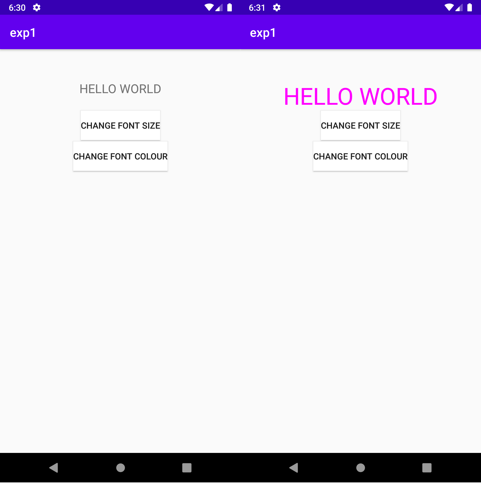

## 2. LAYOUT MANAGERS AND EVENT LISTENERS
- Create a new project in Android studio and choose the Empty Activity under the activities template.
- In the activity_main.xml file, use RelativeLayout, LinearLayout and Grid Layout to position the elements.
- Create a simple form to take in student details. Use Spinner to create the drop down list.
- In the MainActivity.java file, initialize an array for spinner containing the names of the departments a student can be in.
- Create an array adapter class for the spin array. Call setAdapter function on the Spinner object and pass it the ArrayAdapter object created. Use this to call the onItemSelectedListener.
- The onItemSelected event listener has two functions to handle an object selected wherein the code to display the toast message is printed and to do nothing when nothing is selected.
- When the button is clicked the button’s action listener is called and passes the contents of the EditTextBoxes to another activity where they are displayed using FrameLayout. This is achieved by using the Intent class which is used to pass messages and transfer control from one activity to another. It can also be used to jump between applications and various other services.
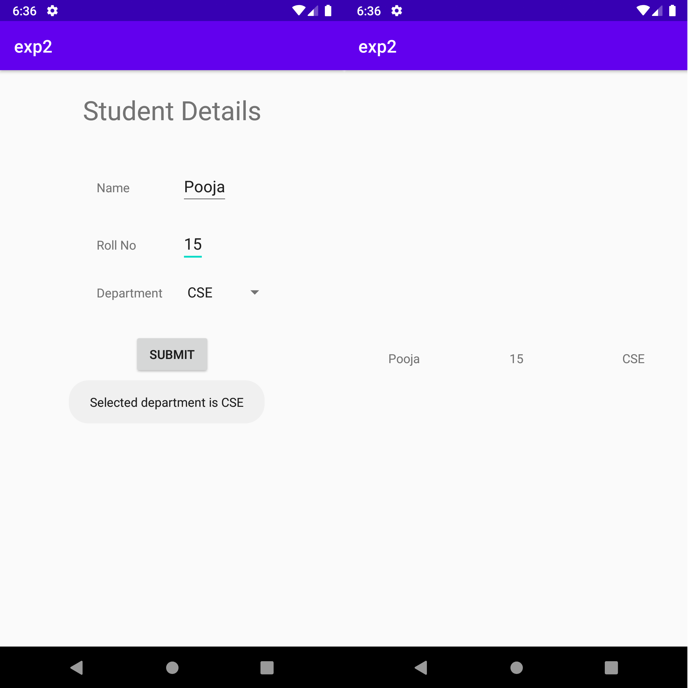

## 3. GRAPHICAL PRIMITIVES
- Create a new project in Android studio and choose the Empty Activity under the activities template.
- In the activity_main.xml file, use RelativeLayout, to create a button which can be clicked each time to change the shape on the screen.
- In the MainActivity.java file, create a private class that extends View where the onDraw() method is overridden to draw various shapes using drawRect, drawLine, drawArc and drawCircle functions. A paint object of the Paint class must be created and passed as argument to the above mentioned functions so that the color mentioned can be used to specify the outline or fill the shapes if style is set to fill.
- An object of the private class is created and on every button click, the object is used to remove the previous view and pass in the new view thereby removing the previous shape and passing in the new shape.
- Each time the view is added and removed, it is done on top of the mainview id  created for the layout in activity_main.xml file, and so the layout and hence the button is not affected.
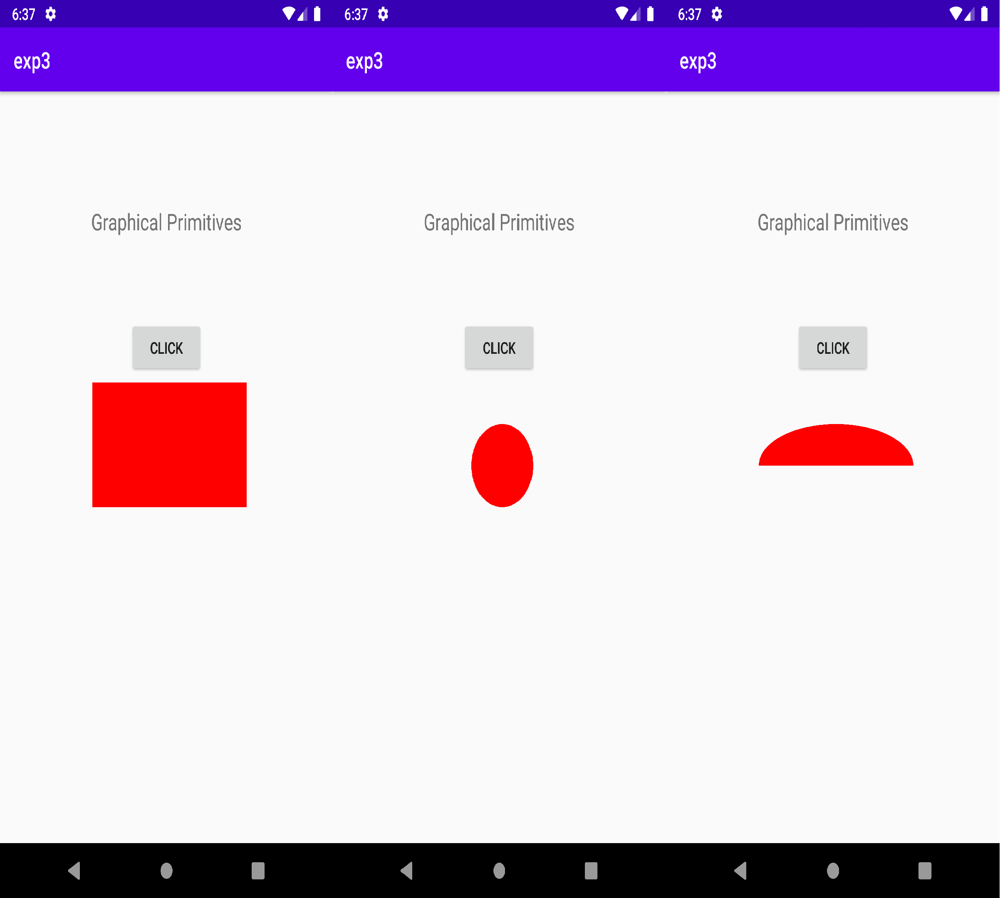

## 4. DATABASE
- Create a new project in Android studio and choose the Empty Activity under the activities template.
- In the activity_main.xml file,create a layout to get student details such as name, roll number and department and also create buttons which can be clicked to insert, view, delete, update the table.
- In the MainActivity.java file, perform the corresponding action for each button click.
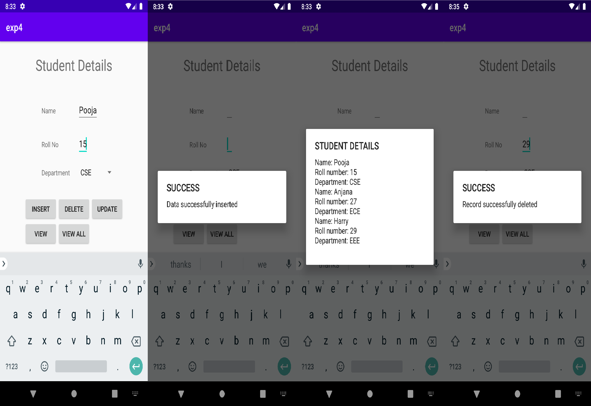

## 5. NOTIFICATION MANAGER
- Create a new project in Android studio and choose the Empty Activity under the activities template.
- In the activity_main.xml file, create a TextView, EditTextBox and a button to say what the app is about, to type in the message and to click on the button to notify. Specify the onClick property of the button to be sendmsg.
- In the MainActivity.java file, create the function corresponding to the sendmsg action where all the activities related to the button click are performed.
- Before beginning to code the MainActivity.java file, create a new Java class for the project by right clicking on the project -> New -> Java Class; give it a name (in my case channel_create) and specify the superclass to be Application and click on Ok. This class represents the application with all its activities and services and is used to set up a  communication channel for the notification at the start of the application and not in the beginning of the activities.
- Override the onCreate method and build the communication channel by checking if the SDK version is greater than Android’s Oreosince only higher versions of Android require a channel to be set up. The communication channels provide a way to identify various notifications of the app defined for different purposes uniquely thereby enabling the user to turn off a notification intended for a specific purpose. Also do not forget to add the android:name=".channel_create" to the manifest file.
- In the MainActivity.java file, get the identifiers for the EditTextBox and create an object for the NotificationManagerCompat which is used to show the notifications while the NotificationManager class is used to create the communication channels.
- In the function defined for the button, build the notification by using the NotificationManagerCompat class.
- Use the notify function to complete the notification process.
- Additionally, here, an Intent is used to create an intent and pass the contents from the edit text box to another activity. Hence the PendingIntent’s flag value(4th parameter) is set to PendingIntent.FLAG_CANCEL_CURRENT.
- On clicking the notification, the user is directed to the second activity where he can read the message.
- In order to truly separate xml (design) and code the sendmsg function can also be called from the onclicklistener of the button in the Java code.
- Add the following to the AndroidManifest.xml file: `android:name=".channel_create"`
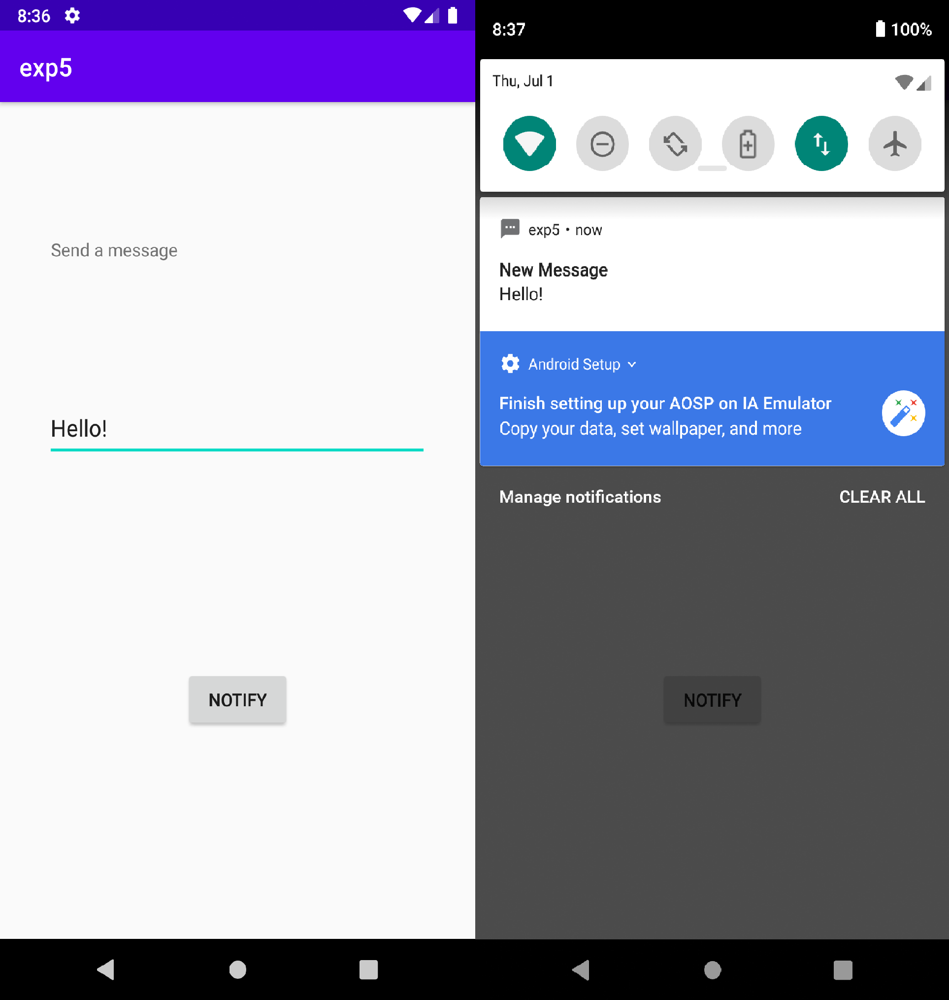

## 6. MULTITHREADING
- Create a new project in Android studio and choose the Empty Activity under the activities template.
- In the activity_main.xml file, include an invisible button and text view that displays the time.
- In the MainActivity.java file, call the updateTime() user defined function (which makes use of the Handler class) every second to check if 20 seconds have elapsed and display the button.
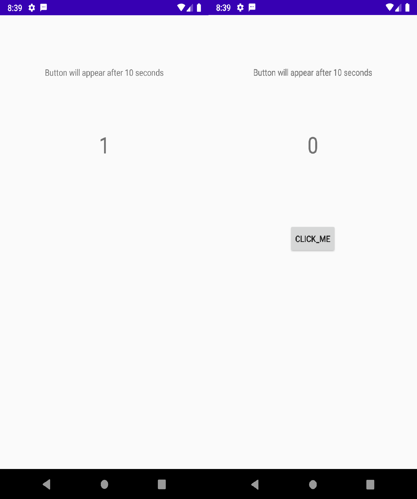

## 7. GPS LOCATION
- Create a new project in Android studio and choose the Empty Activity under the activities template.
- Install Google Play Services SDK by right clicking on the app folder -> Open Module Settings -> Dependencies -> + -> Choose library dependency -> Search for "play-services" -> Double click on the com.google.android.gms:play-services to include Google Play SDK in our project.
- Give the ACCESS_FINE_LOCATION and ACCESS_COARSE_LOCATION permissions using the use-permission tag in the Manifest file
- Also grant location permissions for the application from the emulator’s device settings.
- Add the following to the manifest file.
`<uses-permission android:name="android.permission.ACCESS_COARSE_LOCATION"/>`
`<uses-permission android:name="android.permission.ACCESS_FINE_LOCATION"/>`
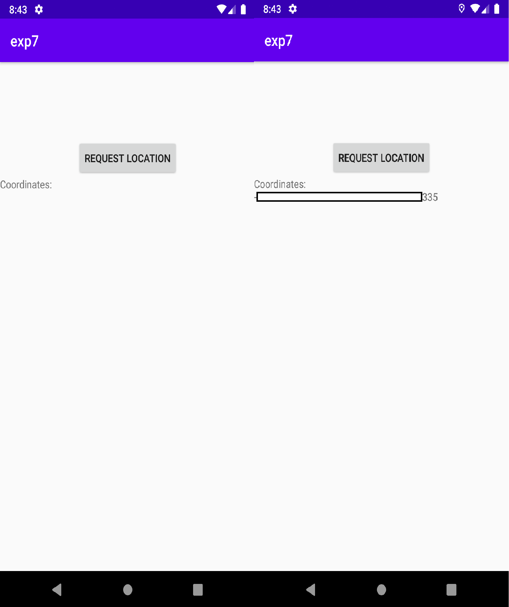

## 8. WRITE DATA TO THE SD CARD
- Create a new project in Android studio and choose the Empty Activity under the activities template.
- In the activity_main.xml file, include 3 buttons to write, read and clear text along with a text box.
- In the java file, write procedures to write contents of the edit text box to the sd card, read the contents from the sd card to the edit text box and to clear the edit text box.
- In the manifest file, include uses-permission tag for write permissions, as follows:
`<uses-permission android:name="android.permission.WRITE_EXTERNAL_STORAGE" />`
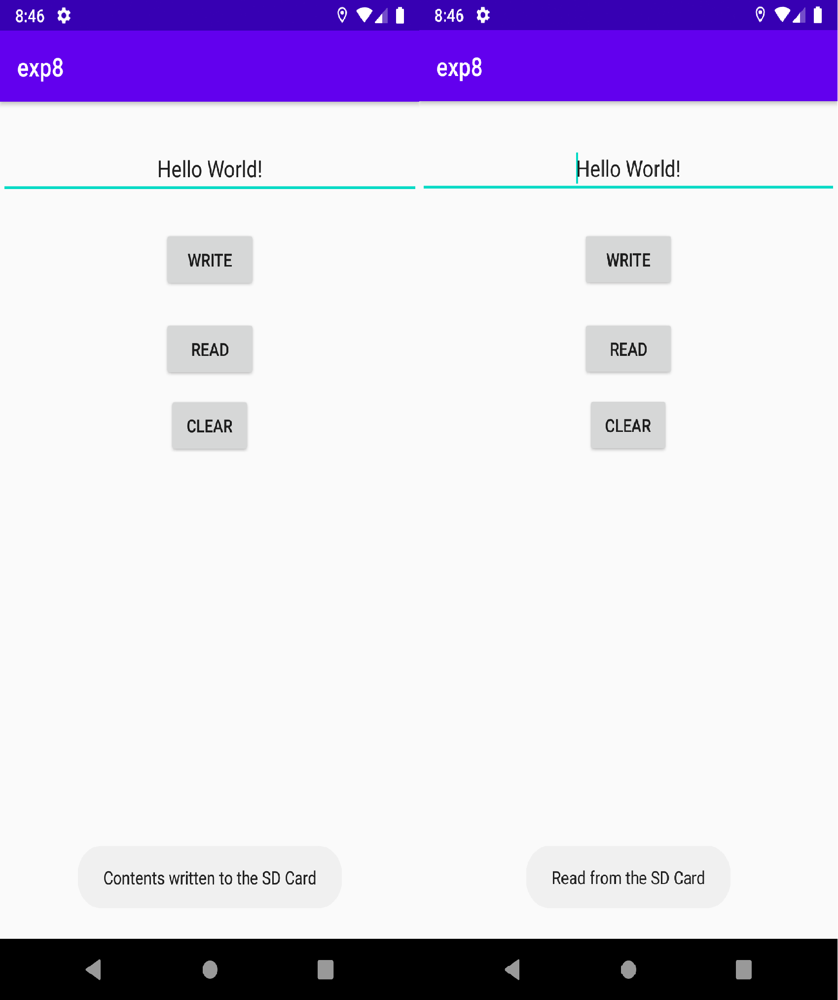

## 9. ALERT ON RECEIVING A MESSAGE
- Create a new project in Android studio and choose the Empty Activity under the activities template.
- In the activity_main.xml file, using Constraint layout, create an EditTextBox and a Button to type in the message and send it.
- In the MainActivity.java file, build the alert dialog box by using the AlertDialog.Builder method and setMessage and setTitle for the alert box. 
- On clicking on the positive “YES” button, the user will be directed to another page where the message can be viewed. On clicking on the negative “NO” button, the user will stay on the same page. You can also incorporate a neutral cancel button like “Remind Me Later”.
- Use the AlertDialog class to create an object for the alert dialog box by invoking the create method of the Builder class.
- Use this object to call show() which completes the process.
- On clicking “YES”, the user is redirected to an activity that is styled using Constraint layout where the user gets to view the message. This activity is created using Intent property in android studio.
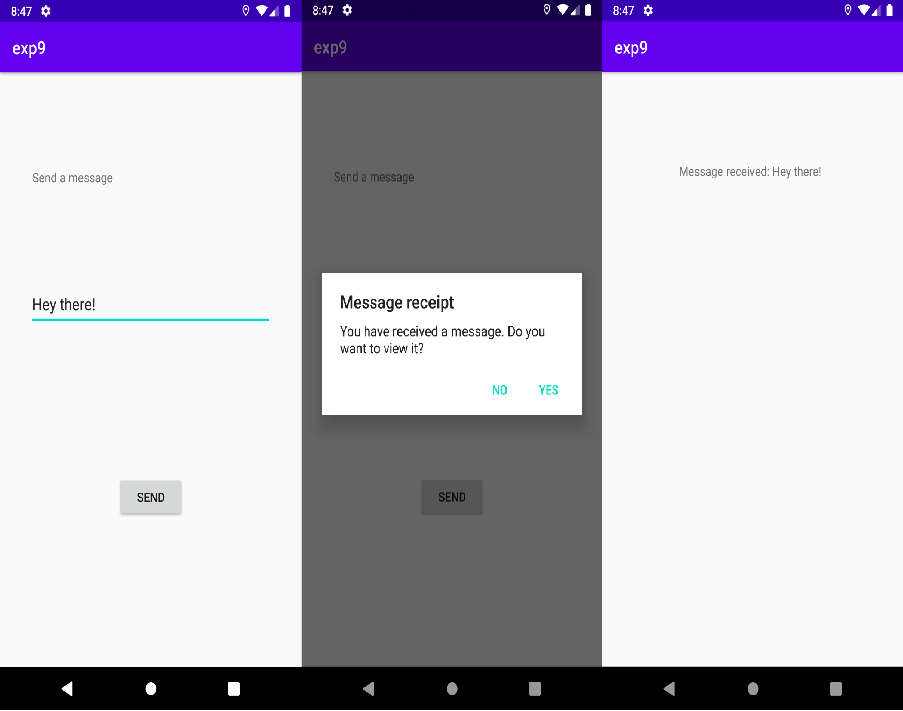

## 10. RSS FEED
- Create a new project in Android studio and choose the Empty Activity under the activities template.
- In the MainActivity.java file, declare a listview array to map the parsed xml rss content to the array.
- In the Android Manifest file, include the use permission tag to get access to the Internet, as follows:
`<uses-permission android:name="android.permission.INTERNET"/>`
- In the xml file, include a listview element.
- On clicking the link, the browser redirects us to the url specified by the link.
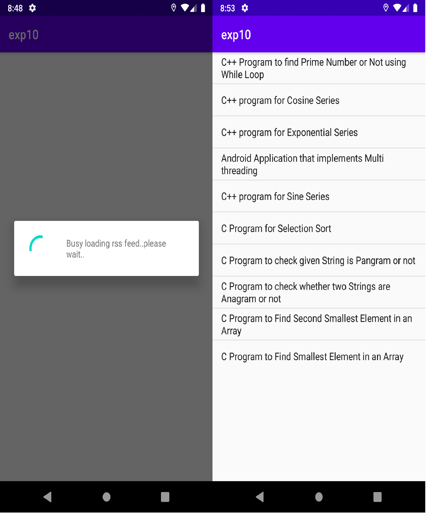

## 11. SEND AN EMAIL
- Create a new project in Android studio and choose the Empty Activity under the activities template.
- In the activity_main.xml file, using Grid layout, create 3 EditTextBoxes and TextViews to get the mailing list, subject and message body from the user and a button to send the email.
- In the MainActivity.java file, create an action event for the button and call the corresponding function (in my case, sendmail).
- In the sendmail function that takes View as argument, create an Intent to send a message on clicking the button using the ACTION_SEND primitive.
- The start activity takes as an argument the create chooser function which is used to allow the user to choose from the Android spreadsheet, the necessary app. On choosing the app, the Intent object passed as argument is used to perform its assigned tasks where it sets the mailing list, subject and body to the one specified in the app.
- Click on send to send the email to the specified mailing list.
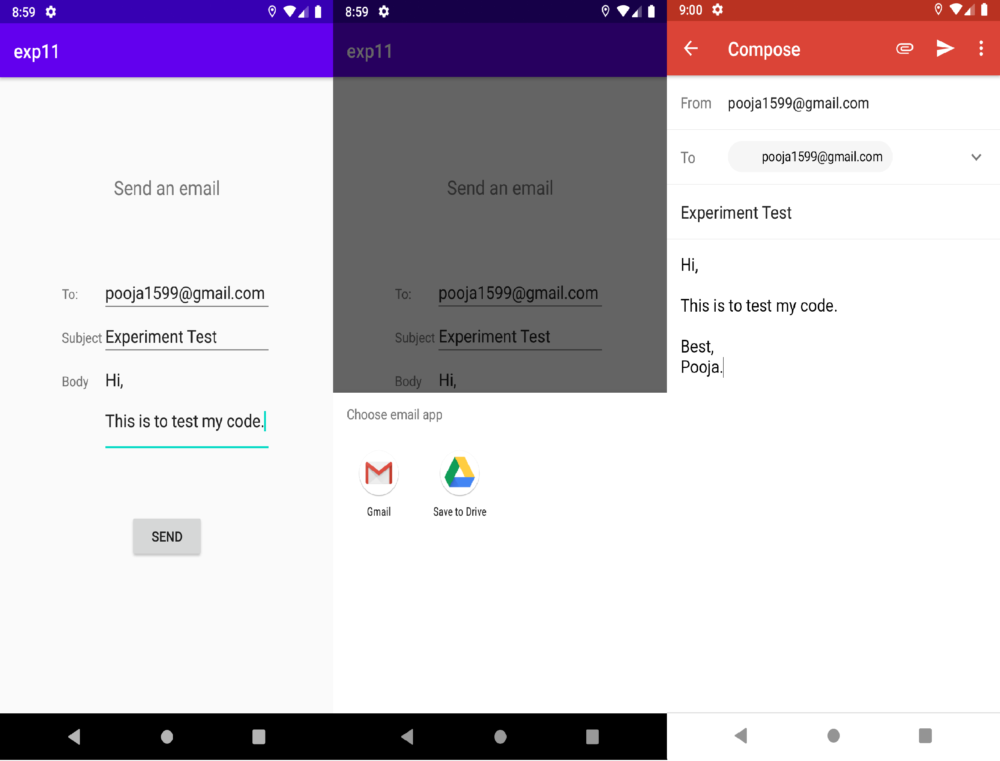

## 12. BONUS - CALCULATOR APP
- Use of android studio to create a calculator application
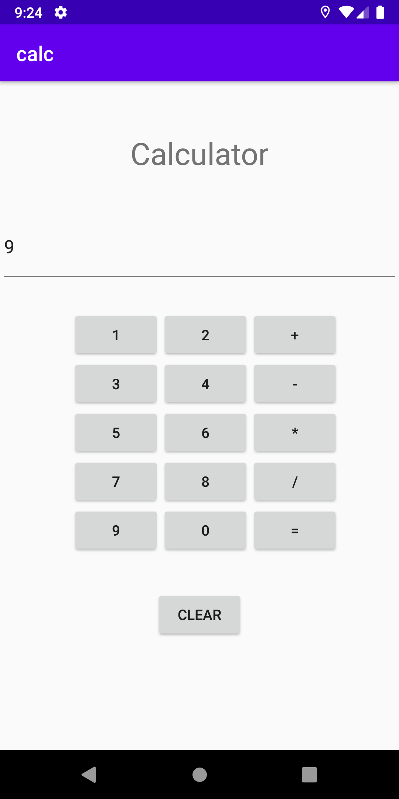

## 13. ACKNOWLEDGEMENT
- Special thanks to Prof. Jeevitha A., for her suggestions to better the code.
- RSS feed application was inspired from [here](https://www.codingconnect.net/android-application-makes-use-rss-feed/)
- For Android Documentation, click [here](https://developer.android.com/docs) 
